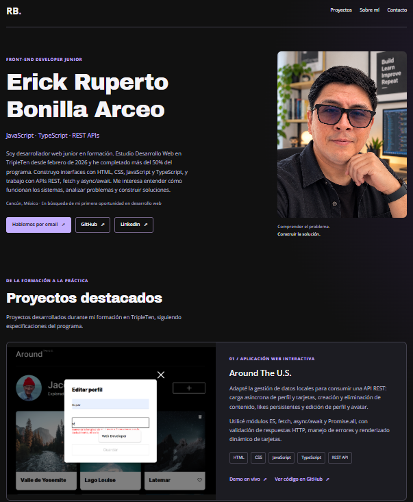

# Portafolio de Ruperto Bonilla Arceo
Portafolio profesional orientado a oportunidades como **Junior Front-End Developer / Junior Web Developer**.

Este sitio reúne mis principales proyectos, habilidades técnicas y formación actual en desarrollo web. El portafolio comenzó como un proyecto de maquetación y ha evolucionado junto con mi formación para convertirse en una presentación de mi trabajo y progreso como desarrollador Front-End.

### 🔗 Demo
**[Ver portafolio publicado](https://ruper-200.github.io/web_project_portfolio_es/)**


## Vista del portafolio
[](https://ruper-200.github.io/web_project_portfolio_es/)

> Haz clic en la imagen para visitar el portafolio.

## Sobre el proyecto
El objetivo de este portafolio es centralizar mis proyectos y proporcionar una forma sencilla de conocer mi trabajo, las tecnologías que utilizo actualmente y mi evolución como desarrollador.

El sitio fue construido con HTML5 y CSS3, aplicando diseño responsivo, estructura semántica y principios básicos de accesibilidad.

Actualmente funciona también como punto de conexión hacia mis proyectos desplegados, repositorios de GitHub, perfil de LinkedIn y medios de contacto.


## Proyectos destacados

### Around The U.S.
Aplicación Front-End interactiva desarrollada con **TypeScript**, **Programación Orientada a Objetos** e integración con una 

**API REST**.
Permite gestionar información de usuario, crear y eliminar tarjetas, administrar likes, actualizar el avatar y persistir los cambios mediante comunicación con un servidor.

**Tecnologías principales:**  
TypeScript · JavaScript · POO · REST API · Fetch API · async/await · HTML5 · CSS3

**[Ver demo](https://ruper-200.github.io/web_project_around_es/)** · **[Ver repositorio](https://github.com/Ruper-200/web_project_around_es)**


### Página de una cafetería
Proyecto de maquetación web enfocado en la construcción de una interfaz utilizando HTML y CSS.
Incluye diseño responsivo y un formulario con validación nativa del navegador.

**Tecnologías principales:**  
HTML5 · CSS3 · Diseño responsivo

**[Ver demo](https://ruper-200.github.io/web_project_coffeeshop_es/)** · **[Ver repositorio](https://github.com/Ruper-200/web_project_coffeeshop_es)**


## Tecnologías del portafolio
El sitio está desarrollado como un proyecto estático y no requiere instalación de dependencias ni proceso de compilación.

Tecnologías y técnicas utilizadas:
- HTML5 semántico.
- CSS3.
- CSS Grid.
- Flexbox.
- Media queries.
- Diseño responsivo.
- Fuentes locales Open Sans y Archivo Black.
- Git para control de versiones.
- GitHub para alojamiento del repositorio.
- GitHub Pages para despliegue.

> Las tecnologías mostradas en cada proyecto corresponden a ese proyecto específico y no necesariamente a la implementación de este portafolio.


## Responsive y accesibilidad
El diseño está preparado para adaptarse a diferentes tamaños de pantalla mediante CSS Grid, Flexbox y media queries.

Entre las consideraciones implementadas se encuentran:
- Adaptación de la interfaz para escritorio, tablet y dispositivos móviles.
- HTML semántico.
- Jerarquía estructurada de encabezados.
- Navegación por secciones.
- Enlace para saltar al contenido principal.
- Textos alternativos en imágenes.
- Estados de foco visibles.
- Enlaces de contacto identificables.
- Uso de `font-display: swap` para las fuentes.
- Carga diferida de imágenes cuando corresponde.


## Estructura del proyecto
```text
web_project_portfolio_es/
│
├── fonts/
│   └── Fuentes utilizadas por el sitio
│
├── images/
│   └── Fotografías, capturas e iconos
│
├── styles/
│   ├── index.css
│   ├── normalize.css
│   └── styles.css
│
├── index.html
├── favicon.ico
└── README.md
